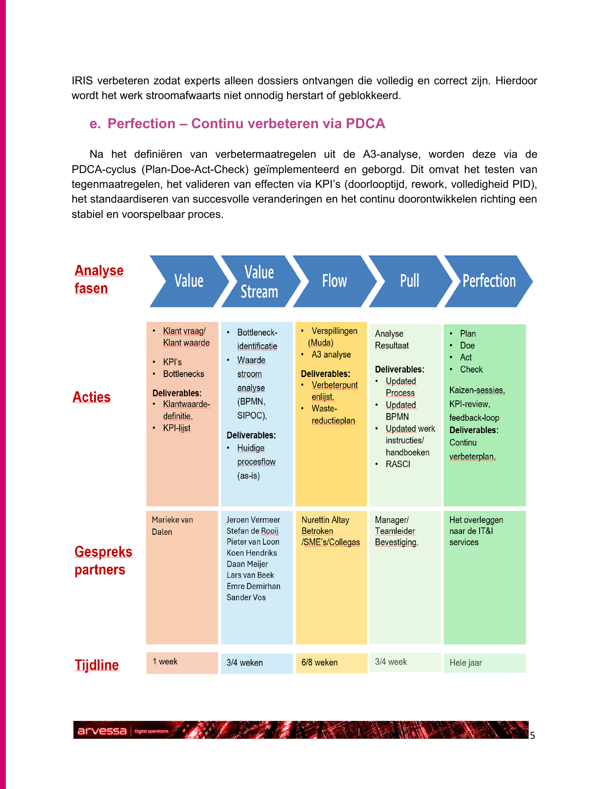
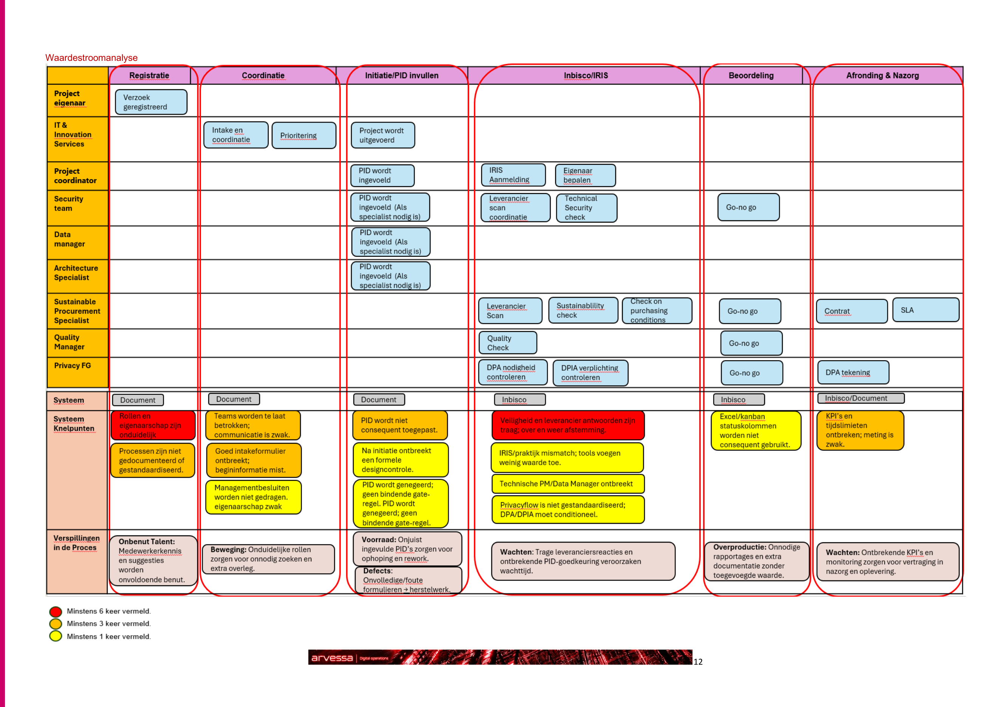
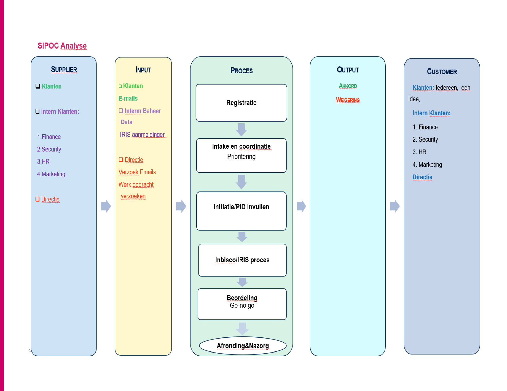
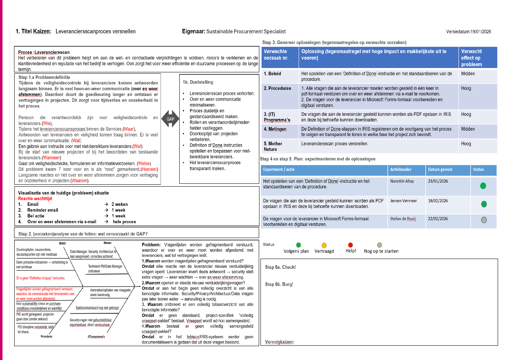
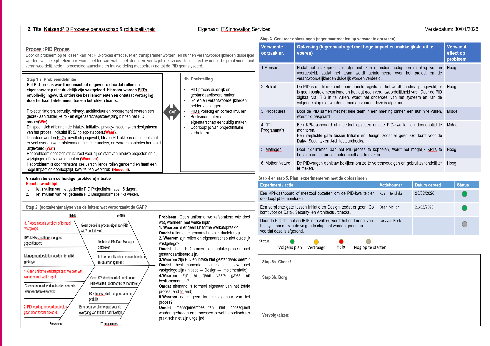
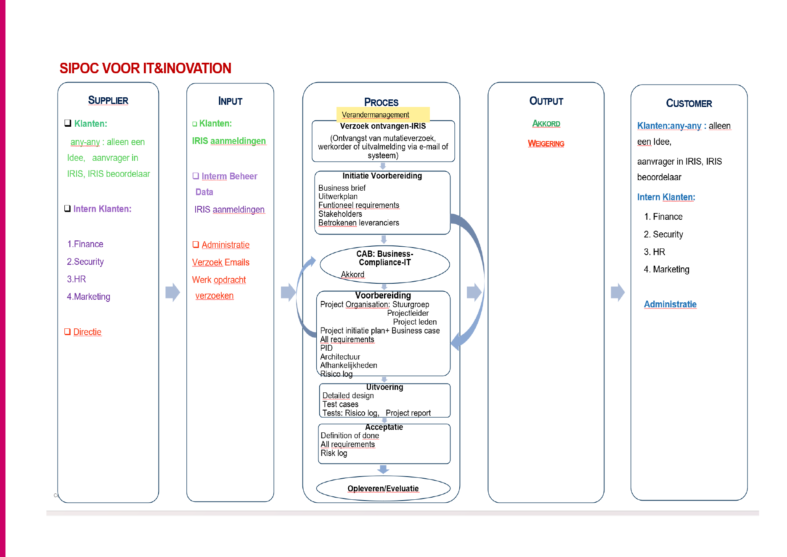
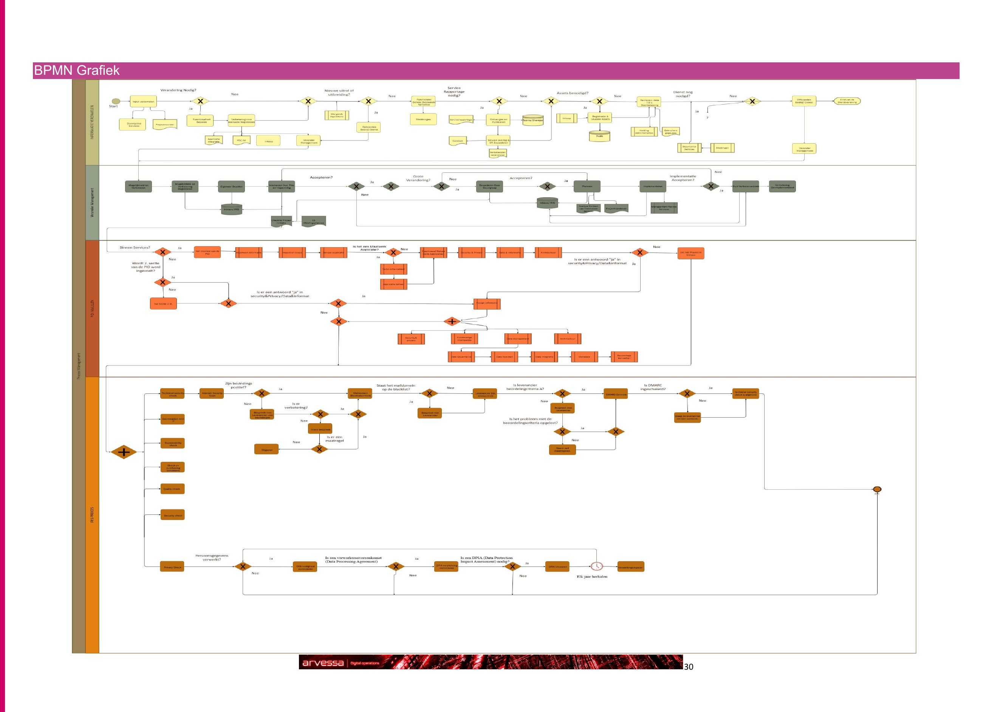

# Lean Process Analysis & Improvement

A practical Lean process improvement case focused on analysing an IT project intake and review process, identifying bottlenecks and designing a more structured and predictable future-state workflow.

> **Note:** This portfolio case has been anonymised.  
> The company name **Arvessa Digital Operations** is fictional and selected organisational details have been modified.

---

## Project Overview

The analysed process contained multiple handovers between business stakeholders, project coordination and specialist teams.

The main challenges included:

- incomplete or inconsistent project information;
- unclear ownership and responsibilities;
- repeated communication between teams;
- manual handovers;
- waiting time during external reviews;
- fragmented information across different channels;
- rework caused by incomplete input.

The objective was to create a process that is more:

- transparent;
- predictable;
- standardised;
- efficient;
- customer-oriented.

---

## Lean Approach

The analysis follows the five Lean principles:

1. **Value**
2. **Value Stream**
3. **Flow**
4. **Pull**
5. **Perfection**

The Lean framework was used to analyse both customer value and process performance and to translate identified bottlenecks into practical improvement actions.

---

## 1. Value

The first step was to determine what creates real value for internal customers and stakeholders.

Important customer expectations included:

- clear project information;
- predictable processing times;
- transparency about project status;
- fewer unnecessary handovers;
- faster decision-making;
- consistent quality of project input.

---

## 2. Value Stream Analysis

The complete process was mapped to understand where value is created and where waiting time, rework and unnecessary handovers occur.

The current-state analysis showed several structural bottlenecks, including high variation between teams, manual handovers, limited standardisation and unclear process ownership.

### SIPOC – Current State

A SIPOC analysis was used to create a high-level overview of suppliers, inputs, process steps, outputs and customers.

This helped identify dependencies between different stakeholders and clarify where process quality depended heavily on the completeness of incoming information.

---

## 3. Flow – A3 Problem Solving

A major part of this project was the use of **A3 problem solving**.

A3 was used not only to describe problems, but to connect:

- problem definition;
- current situation;
- root-cause analysis;
- target condition;
- countermeasures;
- responsibilities;
- measurement and follow-up.

The A3 structure therefore became the central method for translating the Lean analysis into concrete improvement proposals.

---

## A3 Analysis 1 – Delays in External Review

The first A3 focused on delays caused by slow responses and repeated communication during an external review process.

The problem created:

- additional waiting time;
- repeated follow-up;
- uncertainty about project status;
- longer approval lead times.

### Improvement Direction

Possible countermeasures included:

- clearer response expectations;
- structured escalation rules;
- improved communication standards;
- better status visibility;
- explicit ownership of follow-up actions.
## A3 Analysis 2 – Process Ownership & Role Clarity

The second A3 focused on inconsistent process execution caused by unclear roles and ownership.

The analysis showed that unclear responsibilities could result in:

- incomplete project documentation;
- missing decision points;
- repeated coordination;
- unnecessary rework;
- delays between teams.

### Improvement Direction

The proposed future state focuses on:

- clearly assigned process ownership;
- defined responsibilities;
- standardised decision points;
- consistent input requirements;
- improved handover criteria;
- clearer governance.

This reduces ambiguity and helps prevent incomplete work from moving further downstream.
---

## 4. Future-State Process

Based on the identified bottlenecks and A3 analyses, a future-state process was designed.

Key improvement principles include:

- better input quality at the start of the process;
- clear acceptance criteria;
- clearer ownership;
- fewer manual handovers;
- reduced rework;
- structured communication;
- improved process visibility.

The objective is to prevent incomplete work from entering downstream stages and to create a smoother overall flow.

---

## 5. BPMN Process Mapping

BPMN was used to visualise the process flow and the interaction between different roles and process steps.

The model helped make:

- handovers;
- responsibilities;
- decision points;
- dependencies;
- improvement opportunities

visible in a structured way.

---

## 6. Continuous Improvement

The final phase uses the **PDCA cycle** to ensure that improvements are tested, measured and continuously refined.

**Plan → Do → Check → Act**

Suggested performance indicators include:

- total lead time;
- percentage of rework;
- completeness of project input;
- waiting time per process step;
- number of repeated handovers.

Successful changes can then be standardised and incorporated into the normal way of working.

---

## Methods & Techniques

This project demonstrates practical use of:

- Lean Five Principles
- Value Stream Analysis
- SIPOC
- BPMN
- A3 Problem Solving
- 5 Whys
- Ishikawa / Fishbone Analysis
- Muda Analysis
- RACI / RASCI
- PDCA
- Process Improvement
- Root Cause Analysis
- Stakeholder Analysis

---

## What This Project Demonstrates

This project shows my ability to combine **process analysis, structured problem solving and stakeholder-oriented improvement**.

Rather than looking only at individual incidents, I analysed the complete process, identified underlying causes and translated them into practical improvement proposals.

The case demonstrates skills that are relevant for roles such as:

- Functional Application Management
- Business Analysis
- Information Analysis
- IT Project Coordination
- Process Improvement
- Business & IT Consulting

---

## Author

**Nurettin Altay**

Business & Data Analyst | Functional Management | Power BI | Power Platform | AI & Automation
